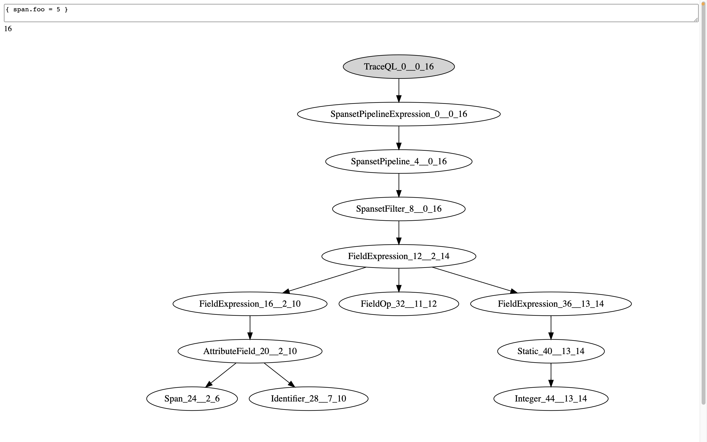

# lezer-traceql

TraceQL lezer grammar based on https://github.com/grafana/tempo/blob/main/pkg/traceql/expr.y.

## Installation

```
npm install
```

## Development
### Building

```
npm run build 
```

### Testing

```
npm test
```

### Tree visualizer

You can use the `tree-viz` tool in the `tools` folder to visualize the outcome of the parser for a given TraceQL query.
Example:


Before using this tool, be sure you have already built the project, as described above.

To run the tool, you need to run a HTTP server first. For instance, you can do this by opening a terminal at the root folder and running:
```bash
npx http-server
```
This should start a HTTP server at `http://127.0.0.1:8080`. You can now fetch the `tools/tree-viz.html` page from the HTTP server: open your browser and visit `http://127.0.0.1:8080/tools/tree-viz.html`.
